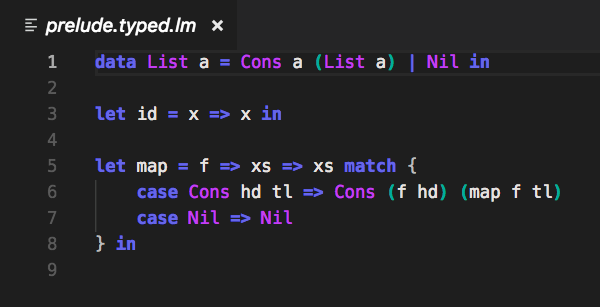

# λ<sub>M</sub>

## Index

1. [Introduction](#introduction)
2. [Motivation](#motivation)
3. [The Language Syntax](#the-language-syntax)
4. [Data Constructors and Pattern Matching](#data-constructors-and-pattern-matching)
5. [The Macro System](#the-macro-system)
6. [Build Instructions](#build-instructions)
7. [A Note about Performance](#a-note-about-performance)
8. [Syntax Highlighting in Visual Studio Code](#syntax-highlighting-in-visual-studio-code)
9. [Contribution](#contribution)

## Introduction

λ<sub>M</sub> is a lazy and untyped experimental programming language with a very small kernel (hereinafter referred to as kernel language).

This project was created in the summer of 2018 as part of the module "Kernel Languages" at the university of applied science [Technische Hochschule Mittelhessen](https://www.thm.de/).

## Motivation

Anyone who already worked with a concatenative programming language like [Factor](https://github.com/factor/factor) or [Consize](https://github.com/denkspuren/consize) knows the genericity that comes with their metaprogramming ability. In those languages it is possible to redefine the whole language with itself, leading to a very small kernel implementation. Furthermore this is possible without sacrificing expressiveness.

The lambda calculus in its original form is also a kernel language. Nevertheless, it is missing the ability to reflect on and change itself. Which in turn means, that the expressiveness of the lambda calculus is very limited. The goal of λ<sub>M</sub> is to fix this limitation.

## The Language Syntax

```
term = let | data | macro | abs ;

let = "let", bindings, "in", term ;
bindings = binding, { ",", binding } ;
binding = app, "=", term ;

data = "data", constructors, "in", term ;
constructors = app, { "|", app } ;

macro = "macro", binding, "in", term ;

abs = app, [ "=>", term ] ;

app = match, { match } ;

match = value, [ "match", "{", cases, "}" ] ;
cases = { case } ;
case = "case", app, "=>", term ;

value = string | list | character | number | tuple | variable ;
values = [ value, { ",", value } ] ;

string = '"', { ? any character ? }, '"' ;
list = "[", values, "]" ;

character = "'", ? any character ? "'" ;
number = digit, { digit } ;

tuple = "(", values, ")" ;

variable = alphanumeric | symbolic ;
alphanumeric = letter, { letter | digit }, { "'" } ;
symbolic = symbol, { symbol | digit }, { "'" } ;

digit = "0" | "1" | "2" | "3" | "4" | "5" | "6" 
      | "7" | "8" | "9" ; 

symbol = "+" | "*" | "~" | "#" | "-" | ":" | "." 
       | "$" | "%" | "&" | "/" | "\" | "=" | "?"
       | "!" | "^" | "°" | "<" | ">" | "|" | "@" ;

letter = "A" | "B" | "C" | "D" | "E" | "F" | "G"
       | "H" | "I" | "J" | "K" | "L" | "M" | "N"
       | "O" | "P" | "Q" | "R" | "S" | "T" | "U"
       | "V" | "W" | "X" | "Y" | "Z" 
       | "a" | "b" | "c" | "d" | "e" | "f" | "g"
       | "h" | "i" | "j" | "k" | "l" | "m" | "n"
       | "o" | "p" | "q" | "r" | "s" | "t" | "u"
       | "v" | "w" | "x" | "y" | "z" ;
```

## Data Constructors and Pattern Matching

There are no built-in data types&ast; other than numbers, characters and tuples. Which means, that even booleans are introduced by the prelude. In order to still be able to add and use control structures like `if` it is possible to match on arbitrary data. For further explanation consider the following example.

> &ast; To be precise, there are no data types (neither statically nor dynamically) in λ<sub>M</sub> at all. Whenever we talk about the datatype of a value, we conceptually talk about the kind of that value. We use the phrase "datatype" to identify values with common properties. For that reason, a `data`-definition does not introduce a type constructor (as it common in languages with algebraic data types). One could call those `data`-definitions "algebraic data constructors".

```
data True | False in

let if = test => then => else => test match {
    case True  => then
    case False => else
} in

if True 0 1
```

The example above shows how `if` may be implemented only using pattern matching. The result of the expression above is always `0`. 

A more complex pattern match can be seen in the following example: 
```
data Cons head tail | Nil in

[1, ('a', "hello"), (3), ()] match {
    case [x, ('b', string), 3, _]  => "hello"
    case [x, ('a', string), _, ()] => "world"
}
```

The result of this example should be `"world"`, since the first pattern does not match (the first value of the twos-tuple is `'a'` but the pattern expects it to be `'b'`). An underscore `_` behaves like a variable binder, but ignores the value.

Strings and list literals are translated to a sequence of `Cons` applications, meaning that `"hello"` is translated to `Cons 'h' (Cons 'e' (Cons 'l' (Cons 'l' (Cons 'o' Nil))))`. Without strings and list literals a pattern match may also be written like:

```
data Cons head tail | Nil in

Cons 1 (Cons 2 (Cons 3 Nil)) match {
    case Cons 1 (Cons 2 (Cons 3 Nil)) => Cons 3 (Cons 2 (Cons 1 Nil))
}
```

## The Macro System

The main feature of λ<sub>M</sub> is its ability to change its own syntax and semantics with the help of the `macro`-system. One can imagine a macro as a function which accepts the rest of the program as a string and returns the replacement for the rest of the program as a syntax tree of λ<sub>M</sub>. To be able to read from files or to perform other side effects a macro returns the syntax tree wrapped in an IO monad.

The following example shows a program, which evaluates to `42`. Regardless of the string `"hello world"` which follows after the `in`, the macro replaces the rest of the program by `42` (represented by the syntax tree node `Num 42`).
```
macro f = content => returnIO (Num 42) in 

"hello world"
```

The full syntax tree of λ<sub>M</sub> can be seen in the [prelude](bootstrap/prelude.lm).

## Build Instructions

1. Install the [Haskell Platform](https://www.haskell.org/downloads)
2. Clone this project
3. Open up a terminal and switch to the project root
4. Execute the command `cabal run`

After the prompt `>` has appeared, you can enter arbitrary terms. Side effects may be executed with the command `:x <term>`.

## A Note about Performance

In its current version λ<sub>M</sub> is very slow, since it implements a statically typed version of itself with parser combinators (as it can be seen in the [prelude](bootstrap/prelude.lm)). In Addition, strings are encoded as lists of characters, which is very convenient but also very slow.

If you are interested in performance optimizations, feel free to apply some improvements. ;-)

## Syntax Highlighting in Visual Studio Code

There is a directory [support/vscode](https://github.com/kuchenkruste/lambda-m/tree/master/support/vscode) which contains TextMate files for syntax highlighting in [Visual Studio Code](https://github.com/Microsoft/vscode). Simply copy this directory into the extension directory of your VS Code installation and you should be able to choose syntax highlighting for "Lambda-M" (you may have to restart VS Code though).



## Contribution

If you are interested in this project do not hesitate to fork and request merge. I will review your work as soon as possible.

If you have any trouble regarding this project please make use of the issue system.
